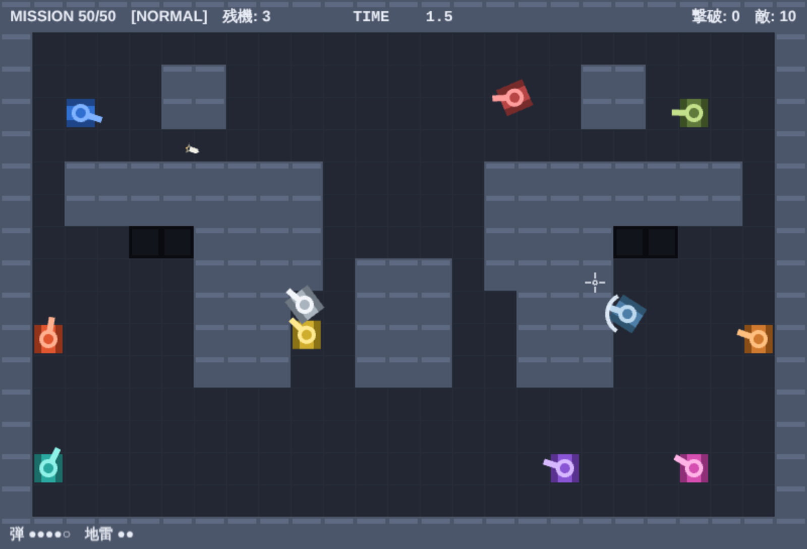
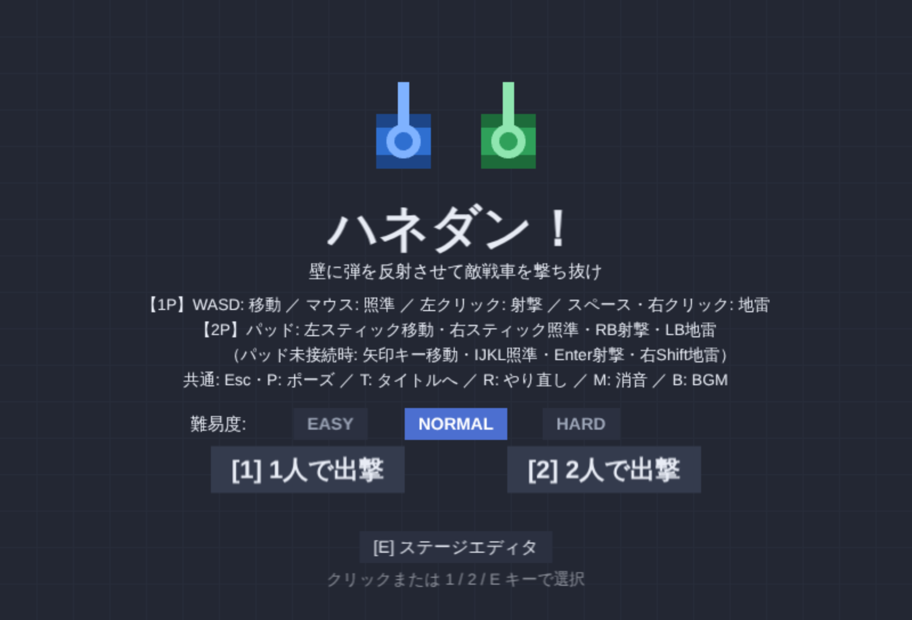
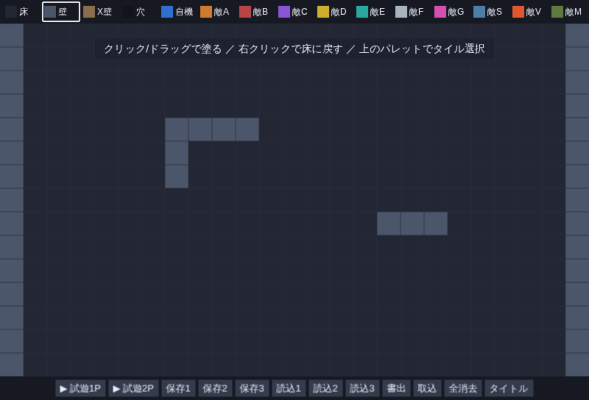

# ハネダン！

壁に弾を反射させて敵戦車を撃ち抜く、ブラウザで動くトップダウン（真上視点）の戦車対戦ゲームです。
全50ミッション、敵10種、難易度3段階。インストール不要で、PC でもスマホでも遊べます。

**▶ [ここで遊ぶ](https://bmb9mm64-source.github.io/-/)**



## どんなゲームか

弾は壁に当たると **入射角＝反射角** で跳ね返ります。敵の正面から撃っても盾で防がれたり、
そもそも遮蔽物の裏に隠れていたりするので、**壁で跳ね返して背後から当てる**のが基本の戦い方です。
弾は同時に5発までしか場に出せず、弾同士は相殺するので、撃ちすぎると自分の攻め手が無くなります。

自分の跳ね返り弾でも自爆するため、「撃つ前に跳ね返りの先を読む」ことがそのまま難しさになっています。

## 遊び方

| | 操作 |
|---|---|
| **PC** | `WASD` 移動 ／ マウスで照準 ／ 左クリックで射撃 ／ `Space`・右クリックで地雷 |
| **スマホ** | 画面の左半分をなぞって移動 ／ 右半分をタッチして照準・連射 ／ 右下のボタンで地雷 |
| **2人プレイ** | 2Pはゲームパッド（左スティック移動・右スティック照準・RB射撃・LB地雷）。未接続時は矢印キー移動・`IJKL`照準・`Enter`射撃・右`Shift`地雷 |
| **共通** | `Esc`・`P` ポーズ ／ `T` タイトルへ ／ `R` やり直し ／ `M` 消音 ／ `B` BGM |

操作を忘れたらポーズ（`Esc`）すると一覧が出ます。

## 収録内容

- **全50ミッション** — M1〜M16 は手設計、M17〜M50 は生成器がつくり、全条件を機械検証しています
- **敵10種** — 固定砲台／遊撃／狙撃／地雷敷設／反射砲台／追跡／多重反射／盾持ち／連射／榴弾。
  数値違いではなく **対処法が変わる** ように設計しています（盾持ちは跳弾必須、榴弾は遮蔽が効かない、など）
- **難易度3段階** — EASY / NORMAL / HARD。記録は難易度別に保存されます
- **ローカル2人協力プレイ**
- **ステージエディタ** — 自分でステージを作って即テストプレイ。3スロット保存と、JSON のコピペで共有できます
- **記録** — ミッション別ベストタイムと通しタイム、到達記録からの「続きから」




## 知財ポリシー

このゲームは Wii Play のミニゲーム「タンク！」の **ゲームメカニクス（ルール・挙動）だけ** を仕様として
再現した個人開発作品です。任天堂は関与していません。

- 任天堂の**画像・音源・コード・固有名称は一切使用していません**
- 再現しているのは著作権保護の対象外である「ルール＝メカニクス」のみです
- ビジュアルは**すべてコード描画**（外部画像ファイルはリポジトリに1つもありません）
- 効果音と BGM は **Web Audio API による自作合成**（外部音源ファイルなし）
- 名称・配色・シルエットはすべてオリジナルです

実行時に外部へ通信することもありません（フォントもシステムフォントのみ）。

## 技術構成

Phaser 3 + Vite + TypeScript（`strict`）。

- `src/core/` は **Phaser 非依存の純粋な TypeScript**。移動・跳弾・敵AI・当たり判定・ミッション進行は
  すべてここにあり、シーンは入力を渡して結果を描画・発音するだけの薄い層です
- 調整値は `src/config/balance.ts` に集約（マジックナンバーを置かない方針）。角度は全体でラジアン統一
- 敵AIは乱数を注入して決定的にテストできます
- **438件の単体テスト**。うち全50ミッションについて「開幕に射線が通らない」「跳弾で倒せる位置が必ず存在する」
  といった成立条件を機械検証しています

仕様の一次ソースは [`docs/gdd.md`](docs/gdd.md)（ゲームデザインドキュメント）です。実装より先に
ドキュメントを更新する運用で、変更履歴に各版の変更理由が残っています。
開発プロセスと役割分担は [`CLAUDE.md`](CLAUDE.md) にあります。

## 手元で動かす

```bash
npm ci
npm run dev      # 開発サーバ
npm test         # 単体テスト
npm run typecheck
npm run build    # dist/ に本番ビルド
```

デバッグ用に `?m=<番号>` で任意のミッションから開始できます（例：`?m=50`）。
